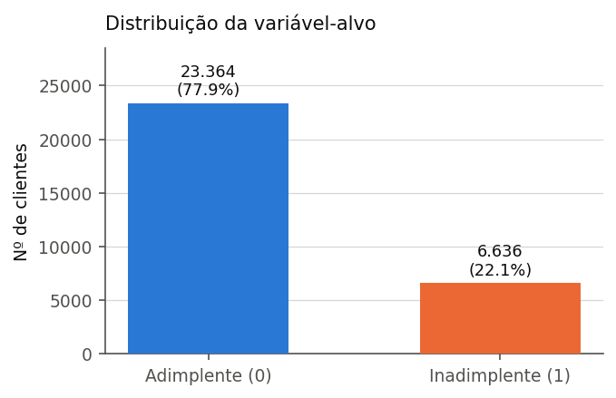
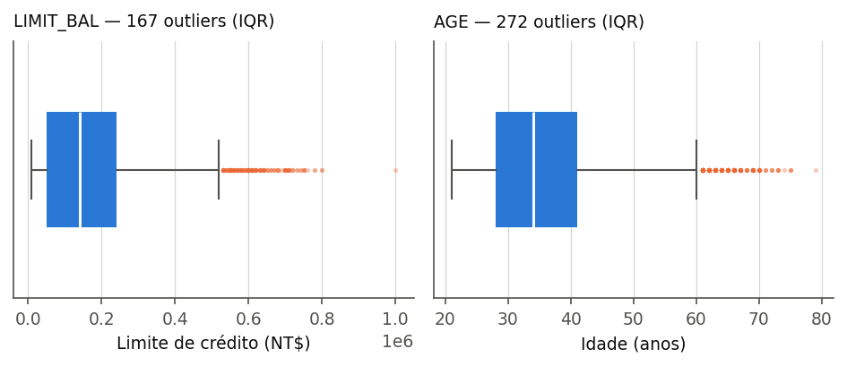
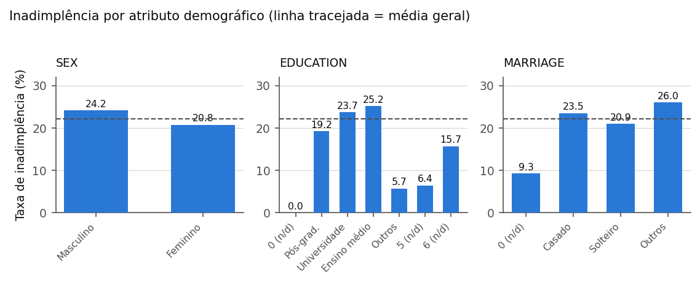
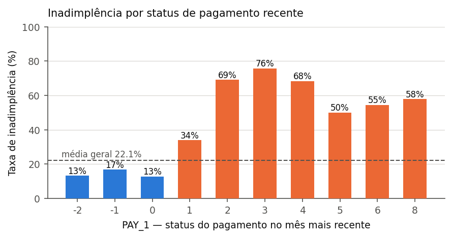
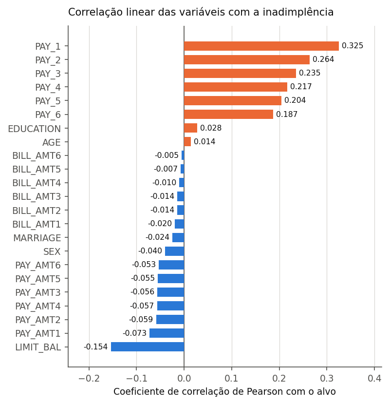

# 3.3 Análise Descritiva dos Dados

Antes de qualquer transformação, a base foi explorada com o objetivo de
caracterizar a distribuição das variáveis, quantificar inconsistências de
codificação e identificar os padrões que orientariam as decisões de
pré-processamento descritas na Seção 3.4. Toda a análise desta seção foi
conduzida sobre a base bruta, com 30.000 registros e 25 colunas, e é
reproduzível pelo notebook `notebooks/01_analise_descritiva.ipynb`.

## 3.3.1 Integridade e completude

A base não apresenta valores ausentes: a varredura das 750.000 células
(30.000 × 25) retornou zero ocorrências nulas, o que dispensa qualquer
estratégia de imputação. Foram identificados, contudo, **35 registros
duplicados** quando desconsiderado o identificador `ID` — pares de clientes com
valores idênticos nas 24 colunas restantes. Como o `ID` é um contador
sequencial sem conteúdo informativo, esses registros representam a mesma
observação repetida e são tratados na Seção 3.4.

## 3.3.2 Distribuição da variável-alvo

A variável-alvo `default payment next month` distribui-se em 23.364 clientes
adimplentes (77,88%) e 6.636 inadimplentes (22,12%), conforme a Figura 1. A
razão entre as classes é de aproximadamente 3,5:1.

**Figura 1 — Distribuição da variável-alvo.**

O desbalanceamento é moderado, mas suficiente para inviabilizar a acurácia
global como métrica de avaliação: um classificador trivial que atribuísse a
classe majoritária a todos os clientes alcançaria 77,88% de acurácia sem
identificar um único inadimplente. Esse resultado sustenta duas decisões
metodológicas do trabalho: a adoção de métricas sensíveis à classe minoritária
(*Recall*, F1 e AUC-ROC), coerente com a assimetria de custos discutida na
Seção 2.1.3, e a aplicação de técnicas de reamostragem restritas ao conjunto de
treino, conforme detalhado na Seção 3.4.

## 3.3.3 Variáveis quantitativas

A Tabela 3 resume as estatísticas descritivas das variáveis contínuas
`LIMIT_BAL` e `AGE`.

**Tabela 3 — Estatísticas descritivas de LIMIT_BAL e AGE.**

| Estatística | LIMIT_BAL (NT$) | AGE (anos) |
|---|---|---|
| Média | 167.484,32 | 35,49 |
| Desvio-padrão | 129.747,66 | 9,22 |
| Mínimo | 10.000 | 21 |
| 1º quartil (Q1) | 50.000 | 28 |
| Mediana | 140.000 | 34 |
| 3º quartil (Q3) | 240.000 | 41 |
| Máximo | 1.000.000 | 79 |

Ambas as distribuições são assimétricas à direita: a média supera a mediana em
`LIMIT_BAL` (167.484 contra 140.000) e em `AGE` (35,49 contra 34). Aplicando o
critério do intervalo interquartil (limites em Q1 − 1,5·IQR e Q3 + 1,5·IQR),
identificam-se **167 outliers em LIMIT_BAL** (0,56% da base, todos acima de
NT$ 525.000) e **272 outliers em AGE** (0,91%, todos acima de 60,5 anos),
representados na Figura 2. Não há outliers no limite inferior de nenhuma das
duas variáveis.

**Figura 2 — Boxplots de LIMIT_BAL e AGE, com destaque para os valores
classificados como atípicos pelo critério IQR.**

Os valores das faturas (`BILL_AMT1` a `BILL_AMT6`) apresentam dispersão bem mais
acentuada, com desvios-padrão superiores a NT$ 59.000 e máximos acima de
NT$ 960.000. Registram-se ainda **3.932 células com fatura negativa**,
distribuídas por 1.930 clientes, e 18.105 células com fatura igual a zero. A
fatura negativa não é erro de coleta: indica saldo credor do cliente junto ao
emissor, situação que ocorre após pagamento a maior ou estorno. Essa
característica tem consequência direta sobre a engenharia de atributos e é
tratada explicitamente na Seção 3.4.

## 3.3.4 Variáveis categóricas e consistência com o dicionário oficial

O confronto entre os valores observados e o dicionário original da base revela
códigos não documentados em dois atributos:

- **EDUCATION** — o dicionário define 1 (pós-graduação), 2 (universidade),
  3 (ensino médio) e 4 (outros). A base contém ainda os códigos 0 (14
  registros), 5 (280) e 6 (51), totalizando **345 registros (1,15%)** sem
  definição documentada.
- **MARRIAGE** — o dicionário define 1 (casado), 2 (solteiro) e 3 (outros). O
  código 0 aparece em **54 registros (0,18%)**, também sem definição.

A Figura 3 apresenta a taxa de inadimplência por atributo demográfico. Os
códigos não documentados de `EDUCATION` (0, 5 e 6) exibem taxas de 0%, 6,4% e
15,7%, próximas da categoria 4 — "outros" (5,7%) — e distantes das categorias
regulares (19,2% a 25,2%), o que ampara a decisão de consolidá-los nessa
categoria residual.

**Figura 3 — Taxa de inadimplência por atributo demográfico.**

O poder discriminante das variáveis demográficas é baixo: a diferença entre
homens (24,2%) e mulheres (20,8%) é de 3,4 pontos percentuais, e entre casados
(23,5%) e solteiros (20,9%), de 2,6 pontos. Nenhuma dessas variáveis se afasta
substancialmente da média geral de 22,1%.

## 3.3.5 Histórico de pagamento e relação com o alvo

O comportamento observado nas variáveis de status de pagamento é o achado mais
relevante da exploração. A Figura 4 mostra a taxa de inadimplência para cada
valor de `PAY_1` (status do mês mais recente).

**Figura 4 — Taxa de inadimplência por status de pagamento no mês mais
recente.**

Há uma descontinuidade nítida entre os códigos não positivos e os positivos: os
clientes com `PAY_1` igual a −2, −1 ou 0 apresentam taxas de 13,2%, 16,8% e
12,8%, abaixo da média geral; a partir de um mês de atraso a taxa salta para
34,0% e, com dois meses, atinge 69,1%. Ou seja, o simples fato de o cliente
registrar atraso no mês corrente aproximadamente triplica a probabilidade de
inadimplência no mês seguinte. Esse padrão justifica a criação de um atributo
que sintetize a recorrência de atrasos ao longo da janela de seis meses,
descrito na Seção 3.4.

A Figura 5 ordena as variáveis pela correlação linear de Pearson com o alvo e
confirma a hierarquia sugerida acima.

**Figura 5 — Correlação de Pearson entre as variáveis de entrada e a
variável-alvo.**

As seis variáveis de status de pagamento ocupam as primeiras posições, com
correlação decrescente conforme o mês se distancia do período de predição
(`PAY_1` = 0,325; `PAY_2` = 0,264; `PAY_6` = 0,187) — evidência empírica de que
a informação comportamental recente é a mais preditiva, em linha com o
resultado reportado por Choi et al. (2025). `LIMIT_BAL` aparece na sequência,
com correlação negativa de −0,154: limites maiores são concedidos a clientes de
melhor perfil de risco.

No extremo oposto, as seis variáveis de valor de fatura (`BILL_AMT1` a
`BILL_AMT6`) apresentam correlação praticamente nula com o alvo, todas com
|r| < 0,02. O valor absoluto faturado, isolado, não discrimina inadimplência —
o que faz sentido do ponto de vista do negócio, já que uma fatura de NT$ 50.000
representa risco distinto para um cliente com limite de NT$ 60.000 e para outro
com limite de NT$ 500.000. Essa constatação motiva a construção de uma variável
de utilização relativa do limite, apresentada na Seção 3.4, e coloca as
variáveis de fatura como candidatas naturais à etapa de redução de
dimensionalidade.
